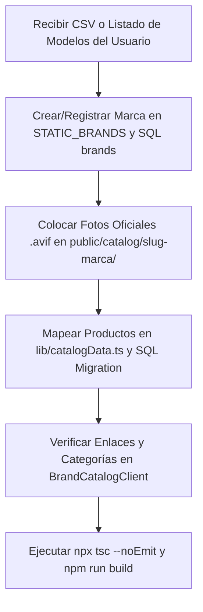

# Módulo: Catálogo Público de Marcas, Equipos y SEO

Guía de referencia y reglas mandatorias para cualquier agente de IA o desarrollador que trabaje en el catálogo público de marcas y productos de **ALFA OS / Portal_Alfa**.

---

## 1. Propósito y Filosofía del Módulo

El objetivo de esta sección pública (`/marcas`, `/marcas/[marca]`, `/marcas/[marca]/[modelo]`) es:

1. **Posicionamiento SEO en Google:** Capturar búsquedas comerciales de alta intención (ej. *"Lutron RRPROC3KIT México"*, *"Sunnata Dimmer cotización"*, *"Lutron RadioRA 3 distribuidor"*).
2. **Presentación High End:** Mostrar a ALFA como distribuidor, especificador e integrador certificado de marcas premium.
3. **Captación de Leads Calificados:** Facilitar la solicitud de cotización formal de ingeniería a través del CRM de ALFA OS (`/api/leads`) y WhatsApp directo.
4. **No es una Tienda Retail:** No se utilizan carritos de compra ni pasarelas de autoservicio. Toda interacción está orientada a proyectos residenciales y corporativos de alto nivel.

---

## 2. Regla de Oro sobre Marcas Autorizadas

> [!IMPORTANT]
> **ÚNICAMENTE agregar marcas que el usuario/dirección de ALFA haya confirmado explícitamente y de las cuales haya proporcionado un listado de productos/modelos.**

- **Prohibido:** No inventar marcas "placeholder" ni activar marcas sin catálogo cargado (por ejemplo, Shelly se encuentra inactiva hasta que se proporcione su catálogo oficial de productos).
- **Marcas Activas Actualmente:**
  - **Lutron** (`/marcas/lutron`): 67 productos oficiales del ecosistema RadioRA 3.
  - **Sonos** (`/marcas/sonos`): 32 modelos oficiales (teatro en casa, bocinas Era, subwoofers, portátiles, Sonos Amp/Port, Sonos Architectural, accesorios). Catálogo cargado desde la lista de precios oficial de distribuidor (`SONOS LP Abril 2025`), **sin exponer precios**. Ver imágenes pendientes en `public/catalog/sonos/`.

---

## 3. Arquitectura y Enrutamiento Público

Todas las rutas de este módulo son **públicas** (no requieren login y son indexables por robots de búsqueda):

| Ruta | Componente / Archivo | Responsabilidad |
| :--- | :--- | :--- |
| `/marcas` | `app/marcas/page.tsx` | Directorio de marcas oficiales activas. |
| `/marcas/[marca]` | `app/marcas/[marca]/page.tsx` | Hub de marca, presentación de certificaciones y catálogo de modelos. |
| — | `app/marcas/[marca]/BrandCatalogClient.tsx` | Componente cliente con buscador en tiempo real y tabs de categorías. |
| `/marcas/[marca]/[modelo]` | `app/marcas/[marca]/[modelo]/page.tsx` | Ficha técnica de ingeniería, Schema.org JSON-LD y cotizador. |
| — | `lib/catalogBrandUi.ts` | Copys y etiquetas de presentación por marca (línea de producto, texto de asesoría, placeholder del buscador, `interest` de leads). Los componentes del catálogo son genéricos; aquí viven las diferencias por marca. |
| — | `app/marcas/[marca]/[modelo]/ProductDetailImage.tsx` | Visualizador de imagen con fallback multi-formato. |
| — | `app/marcas/[marca]/[modelo]/ProductQuoteModal.tsx` | Modal de cotización conectado a `/api/leads`. |
| `/sitemap.xml` | `app/sitemap.ts` | Generador de sitemap dinámico que incluye cada marca y producto. |

---

## 4. Reglas Críticas de Seguridad y Protección de Datos

> [!CAUTION]
> **NUNCA exponer datos de costos internos, proveedores ni márgenes en el frontend o APIs públicas.**

1. **Datos Prohibidos en el Catálogo Público:**
   - `cost_price` y `cost_currency` (costos de distribuidor).
   - `labor_unit_cost` y `labor_sale_multiplier`.
   - `target_margin` y proveedores asociados.
2. **Capa Segura de Base de Datos:**
   - Utilizar la vista sanitizada `public.public_catalog_products` (`sql/20260827_brands_and_catalog_seo.sql`), la cual solo expone: `id`, `slug`, `brand_name`, `brand_slug`, `model`, `name`, `sku`, `short_description`, `description`, `category`, `image_url`, `specifications`, `highlights`, `warranty_years`, `seo_title`, `seo_description`, `seo_keywords`.
3. **Capa de Dominio en Código:**
   - Toda consulta pública debe pasar por `lib/catalog.ts` y usar `lib/catalogData.ts` como fallback tipado para SSG / renderizado estático.

---

## 5. Reglas de Imágenes y Almacenamiento

> [!WARNING]
> **NO utilizar enlaces a servidores externos que requieran autenticación, bloqueen hotlinking o no cuenten con HTTPS/SSL.**

1. **Ubicación Local Obligatoria:**
   - Las imágenes de productos deben residir en `public/catalog/[slug_marca]/` (ej. `public/catalog/lutron/`).
2. **Formato Preferente:**
   - `.avif` (formato estándar de última generación optimizado para velocidad y SEO).
3. **Nomenclatura Estricta:**
   - Nombre del archivo = **modelo en minúsculas** (ej. `rrproc3kit.avif`, `rrstpronwh.avif`, `lubp1.avif`).
4. **Cadena de Fallback Multi-Formato en Frontend:**
   - Los componentes de imagen (`BrandCatalogClient.tsx` y `ProductDetailImage.tsx`) deben implementar el manejador `onError` que intenta en este orden:
     $$\text{.avif} \longrightarrow \text{.png} \longrightarrow \text{.jpg} \longrightarrow \text{.jpeg} \longrightarrow \text{.webp}$$
5. **Propiedades Visuales del ALFA Design System:**
   - Usar `referrerPolicy="no-referrer"`.
   - Contenedores con degradado sutil (`bg-gradient-to-b from-white/[0.06] to-black/40`) y `object-contain`.

---

## 6. Captación de Leads y Conexión con CRM

Cualquier acción de contacto en la página de producto debe alimentar directamente el CRM de ALFA OS:

1. **Vía Formulario de Cotización (`ProductQuoteModal.tsx`):**
   - Debe hacer un `POST` a `/api/leads` con:
     ```json
     {
       "name": "Nombre del cliente",
       "phone": "3312345678",
       "company": "Despacho o Empresa",
       "customerType": "residencial | arquitecto_interiorista | comercial | corporativo",
       "service": "Cotización de Producto: [Marca] [Modelo]",
       "interest": "Iluminación y persianas (Lutron / Shelly)",
       "message": "Comentarios...\n\n[Producto SKU: ... - Slug: ...]",
       "source": "Landing Web",
       "status": "nuevo"
     }
     ```
2. **Vía WhatsApp Directo:**
   - Enlace `https://wa.me/523318574884?text=...` con texto precargado que detalle el modelo y nombre del equipo solicitado.

---

## 7. SEO y Datos Estructurados (Schema.org)

Cada página de producto y marca debe incluir:

1. **Metadatos Dinámicos (`generateMetadata`):**
   - `<title>` optimizado: `[Marca] [Modelo] | Cotización e Integración en México | ALFA`
   - `<meta description>` comercial orientada a suministro oficial y soporte técnico.
   - Canonical URL absoluta (`https://www.alfait.com.mx/marcas/[marca]/[modelo]`).
2. **JSON-LD Structured Data:**
   - `Schema.org/Product` con marca, SKU, modelo, descripción y oferta con disponibilidad en stock y condición nuevo.
   - `Schema.org/BreadcrumbList` para mostrar la jerarquía en los resultados de Google.
3. **Inclusión en Sitemap:**
   - El archivo `app/sitemap.ts` debe mapear automáticamente todas las URLs de productos y marcas con frecuencia semanal y prioridad alta (`0.85` - `0.95`).

---

## 8. Procedimiento Paso a Paso para Agregar una Nueva Marca

Cuando el usuario solicite dar de alta una nueva marca, seguir estrictamente este flujo:



1. **Verificar datos:** Revisar modelos, SKUs, descripciones y categorías entregadas.
2. **Registrar Marca:** Agregar el objeto `Brand` en `lib/catalogData.ts` y en `sql/20260827_brands_and_catalog_seo.sql`.
3. **Guardar Imágenes:** Colocar las fotos en `public/catalog/[marca]/[modelo].avif`.
4. **Mapear Productos:** Añadir los registros en `lib/catalogData.ts` (con especificaciones clave-valor y viñetas).
5. **Comprobar Sitemap:** Verificar que `app/sitemap.ts` incluya la nueva marca y sus modelos.
6. **Validar Compilación:**
   ```bash
   npx tsc --noEmit
   npm run build
   ```
